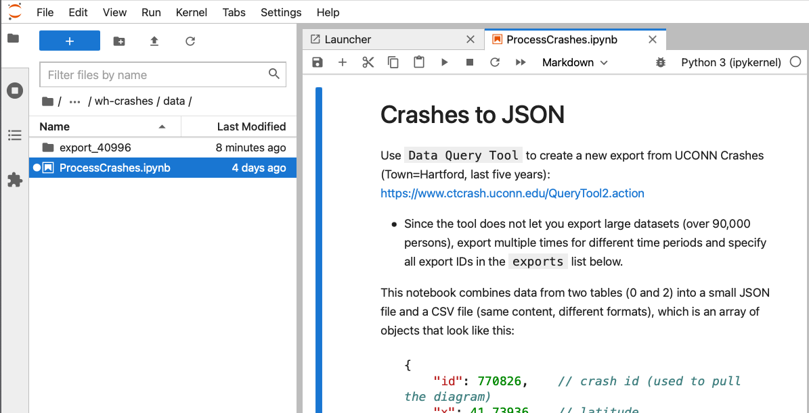

# West Hartford Crashes

Data visualization of motor vehicle crashes in West Hartford CT from 2015 to present, displaying pre-processed data from UConn Connecticut Crash Data Repository

## Links
- Live map https://bikewesthartford.github.io/wh-crashes


## Credits
- Adapted by [Jack Dougherty](https://jackdougherty.org), Trinity College professor, and [Keelyn McNamara](https://github.com/Keelymac32), Trinity College Class of 2023, who edited Python and JavaScript.
- Based on the [original Hartford Crash Data heatmap](https://github.com/Picturedigits/hartford-crashes) created by Ilya Ilyankou at [Picturedigits](https://www.picturedigits.com) for Transport Hartford.

## Data
All data in this tool is exported monthly from the UConn Connecticut Crash Data Repository <https://www.ctcrash.uconn.edu>, which is "designed to provide access to select crash information collected by state and local police," which may be preliminary or delayed (1-6 months). See UConn site for more details about data collection and intrepretation.

In general, with some exceptions noted below, the UConn Connecticut Crash Data Repo is based on MMUCC codes from the US Dept of Transportation, National Highway Traffic Safety Administration, *Model Minimum Uniform Crash Criteria, 5th Edition*, https://www.nhtsa.gov/mmucc-1

### Table Exports
When exporting crash data in CSV format from the UConn Crash Data Repo, the export arrives as four CSV tables that end with these numbers:

- 0 Crashes (with unique CrashID)
- 1 Vehicles (since more than one vehicle may be involved in each crash)
- 2 Persons (since more than one person may be involved in each crash, and may not be in a vehicle)
- 3 Trailers

### Person Type Code
UConn Crash Data Repo uses its own numbering system (not identical to MMUCC) for Person Type Codes, with the most relevant ones shown below:

- 3 Pedestrian
- 4 Other Pedestrian (wheelchair, person in a building, skater, pedestrian conveyance)
- 5 Bicyclist
- 6 Other Cyclist

Since "Other" values are very small, in this tool we combine 3 and 4 into "Pedestrians" and combine 5 and 6 into "Cyclists"

Important: Person Type Codes in UConn Crash Data Repo do NOT match MMUCC Person Type Codes (PDF page 60), where 4-5-6-7 represent Bicyclist, Other Cyclist, Pedestrian, Other Pedestrian, respectively.

### Most Severe Injury Code

This tool displays crashes according to Most Severe Injury code, among any injuries reported, in the UConn Crash Data Repo. Do NOT confuse Most Severe Injury with either Crash Severity in the UConn Crash data (which does not distinguish between types of injuries) or the total number of injured people (which is higher because each crash may have multiple injuries). The 5 codes for Most Severe Injury in the UConn Crash data match these MMUCC codes for Crash Severity (section C19, PDF p. 30), based on MMUCC codes for Injury Status (section P5, PDF p. 62)

- K = Fatal: A fatal injury is any injury that results in death within 30 days after the motor vehicle crash in which the injury occurred. If the person did not die at the scene but died within 30 days of the motor vehicle crash in which the injury occurred, the injury classification should be changed from the attribute previously assigned to the attribute “Fatal Injury.”
- A = Suspected Serious Injury: A suspected serious injury is any injury other than fatal which results in one or more of the following:
    - Severe laceration resulting in exposure of underlying tissues/muscle/organs or resulting in significant loss of blood
    - Broken or distorted extremity (arm or leg)
    - Crush injuries
    - Suspected skull, chest or abdominal injury other than bruises or minor lacerations
    - Significant burns (second and third degree burns over 10% or more of the body)
    - Unconsciousness when taken from the crash scene
    - Paralysis
- B = Suspected Minor Injury: A minor injury is any injury that is evident at the scene of the crash, other than fatal or serious injuries.
- C = Possible Injury: A possible injury is any injury reported or claimed which is not a fatal, suspected serious, or suspected minor injury. Examples include momentary loss of consciousness, claim of injury, limping, or complaint of pain or nausea. Possible injuries are those that are reported by the person or are indicated by his/her behavior, but no wounds or injuries are readily evident.
- O = No Apparent Injury: No apparent injury is a situation where there is no reason to believe that the person received any bodily harm from the motor vehicle crash. There is no physical evidence of injury and the person does not report any change in normal function.

Furthermore, in this tool we combine and abbreviate *Injuries* as follows:

- Fatal = K
- Serious = A
- Other = B + C
- Property Damage = 0

Note: Based on police reports of *suspected* or *possible* injuries

To be clear, police may not have training or time to accurately distinguish between *serious* or *minor* or *possible* injuries. But our tool separates *fatal* and *serious* injuries apart from others, based on the best available data, because these most severe categories matter for Vision Zero transportation safety planning.

## Create Your Own Version
This open-source GitHub repository includes a JupyterLab notebook data processor and Leaflet map code that can be adapted for other towns in Connecticut, or other states that have similar data. These instructions assume you have some familiarity with creating your own fork and hosting a GitHub repository of simple Leaflet map code. If not, read [Chapter 10: Edit and Host Code in GitHub](https://handsondataviz.org/github.html) in our Hands-On Data Visualization book.

### Setup and Download Data from UConn Connecticut Crash Repository
1. Create your own fork of this GitHub repository. Recommended: Use GitHub Desktop to migrate files between your online repository and your local computer.
2. Navigate to https://www.ctcrash.uconn.edu/ and create an account if you don't have one yet.
3. Log in, and go to `Data Query Tool`.
4. Select a `MMUCC(2015-)` dataset, specify dates and town (or multiple towns).
5. Run the query, and then click `Export To CSV` button above the interactive table. A link will be sent to your email account to download the archive. Note that the tool may prevent you from exporting datasets that are "too large". In that case, break down your query (for example, instead of downloading 2015-2020 data, do 2015-2018 as one export, and 2019-2020 as another).
6. Unzip the archive(s), then move the `export_#####` folder to place it inside the `data/` folder of your forked GitHub repository.
7. Delete the existing files named `crashes.csv` and `crashes.json` in the data folder, and also the existing `export_old###` folder.

## Pre-process data with JupyterLab
1. Use JupyterLab <https://jupyter.org> to pre-process the data. One simple method is to install the free (but large) Anaconda platform on your local computer <https://www.anaconda.com>, then launch JupyterLab, which runs in your browser.
2. In JupyterLab, navigate to your local computer to open the Jupyter notebook file inside the data folder, which in this example is `wh-crash-map/data/ProcessCrashes.ipynb`.
3. In step 2 of the Juypter notebook file, insert your export ID (numbers) from your UConn Crash Repo download to the `exports` list. Save your notebook.
4. Important: Go back to step 1 and run the notebook. After all steps are complete, it should generate a new CSV (`crashes.csv`) and a JSON file (`crashes.json`) in the `data/` folder.
5. Migrate any relevant files from your local computer to your forked GitHub repository online, and use the GitHub Pages setting to host your repo online.



### Modify the Leaflet map settings
1. Modify the `index.html` of the Leaflet map in your forked GitHub repository to set custom map title, and `script.js` to change initial coordinates, date ranges, and anything else related to the map. For example, see around line 38
```
// display initial data, where Jan = 0 and Dec = 11
var initFrom = dateToTS(new Date(2020, 0, 1));
var initTo = dateToTS(new Date(2022, 11, 31));
```
See also around line 159
```
// Initialize Ion range slider
var slider = $(".js-range-slider").ionRangeSlider({
    type: 'double',

    // set full range display, where 0 = Jan and 11 = Dec
    min: dateToTS(new Date(2015, 0, 1)),
    max: dateToTS(new Date(2022, 11, 31)),
```

2. This map is fully front-end, and loads data once from the CSV file using PapaParse JS library. Optional: You can change the code to fetch the JSON file using `$.getJSON()` function of jQuery, although it is slightly heavier than the CSV.

### I still have questions
Get in touch with ilya@picturedigits.com if you have any other questions or suggestions.

### License
MIT
